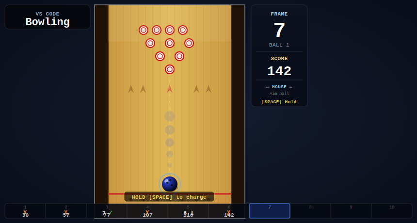

<div align="center">
  
  <br/><br/>
  
  <br/><br/>

  [](https://isocialpractice.github.io/vscode-bowling/)
  &nbsp;
  [](https://marketplace.visualstudio.com/items?itemName=isocialPractice.vscode-bowling)
  &nbsp;
  [](LICENSE)
</div>

---

A classic arcade bowling game that lives inside **VS Code** — inspired by *World Class Bowling*. Throw, hook, and spin your way to a perfect 300. Also playable directly in the browser with no install required.

---

## Play in the Browser

> **[isocialpractice.github.io/vscode-bowling](https://isocialpractice.github.io/vscode-bowling/)**

No install. No sign-in. Click and bowl.

---

## Install the VS Code Extension

1. Open VS Code
2. Press `Ctrl+Shift+X` to open the Extensions panel
3. Search **"VS Code Bowling"**
4. Click **Install**
5. Press `Ctrl+Shift+B` — or open the Command Palette (`Ctrl+Shift+P`) and run **"Play Bowling"**

---

## Controls

| Action | Input |
|---|---|
| **Aim** | Move mouse left / right while ball is on lane |
| **Charge power** | Hold `Space` → drag mouse **down** |
| **Throw** | While charging, flick mouse **up** |
| **Speed** | How fast you flick up |
| **Direction** | Horizontal position of your flick |
| **Spin / Hook** | Horizontal velocity of your flick |
| **Cancel throw** | Press `Esc` while charging |
| **Start / Restart** | Click the lane **or** press `Enter` |

> Designed for mouse with a trackball. The harder you pull back and flick, the faster and harder the ball rolls.

---

## Scoring

Standard 10-frame bowling rules:

- **Strike** (`X`) — all 10 pins on the first ball; score is 10 + next 2 rolls
- **Spare** (`/`) — remaining pins cleared on the second ball; score is 10 + next 1 roll
- **Open frame** — sum of both balls
- **10th frame** — up to 3 balls when a strike or spare is bowled
- **Perfect game** — 12 consecutive strikes = **300**

---

## Features

- Trackball-style mouse controls with hook physics
- Ball spin curves the trajectory across the lane
- Live top-down Three.js gameplay with STL bowling ball and pin models
- Logical 2D pins drive knockdown, scoring, and deadwood clearing while STL meshes stay visual-only
- Optional post-turn replay with an angled alley camera, visible replay lane, and a sidebar toggle to turn replays on or off
- Standard 10-frame scoring with bonus ball support
- Live scorecard with strike / spare symbols
- State-aware HUD with control hints
- Power meter with animated feedback
- Strike / Spare / Gutter flash messages
- Fallen pin sweep between throws
- Frame-complete Three.js replay animation after strikes and completed turns
- Works in VS Code **and** as a standalone browser page

---

## Development

```bash
# Clone
git clone https://github.com/isocialPractice/vscode-bowling.git
cd vscode-bowling

# Install dependencies
npm install

# Compile TypeScript extension host
npm run compile

# Launch in VS Code (opens Extension Development Host)
# Press F5 in VS Code
```

The gameplay logic lives in `media/game.js` as a hybrid Canvas + Three.js renderer. The 2D pin rack remains the authoritative gameplay state for knockdown and scoring, while the STL ball and pin meshes mirror that state for live graphics and the optional post-turn replay, including the replay lane and improved pin carry animation. `src/extension.ts` remains the VS Code WebView host.

---

## Project Structure

```
vscode-bowling/
├── src/
│   └── extension.ts     VS Code extension entry point
├── media/
│   ├── game.js          Bowling gameplay, scoring, physics, and Three.js overlay
│   ├── game.css         Browser and webview styles
│   ├── BowlingBall.stl  Bowling ball model used in live gameplay
│   ├── BowlingPin.stl   Bowling pin model used in live gameplay
│   ├── STLLoader.js     Three.js STL loader
│   └── three.min.js     Three.js runtime
├── index.html           Browser preview entry point
├── favicon.svg          Browser favicon
├── logo.svg             Project logo
├── hero.svg             README hero image
├── TODO.md              Planned features and patches
└── package.json         Extension manifest
```

---

## Roadmap

See [TODO.md](TODO.md) for the full list of planned patches, updates, and surprise features.

---

## License

MIT © isocialPractice
